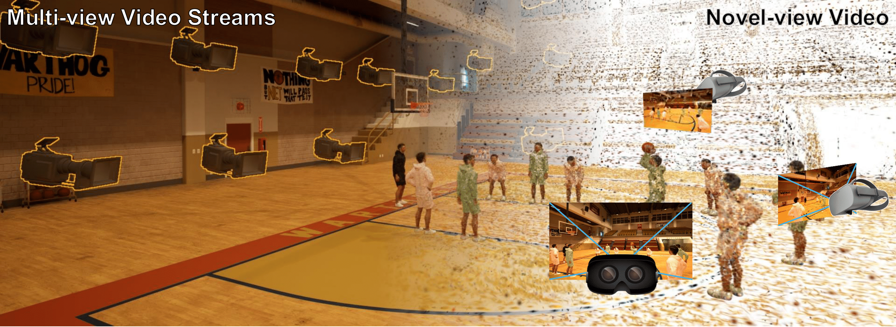
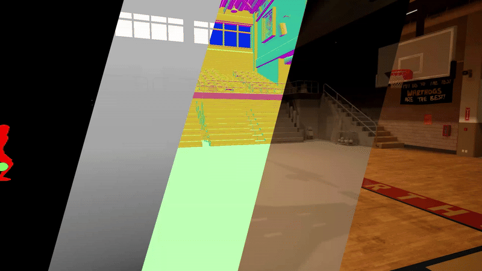
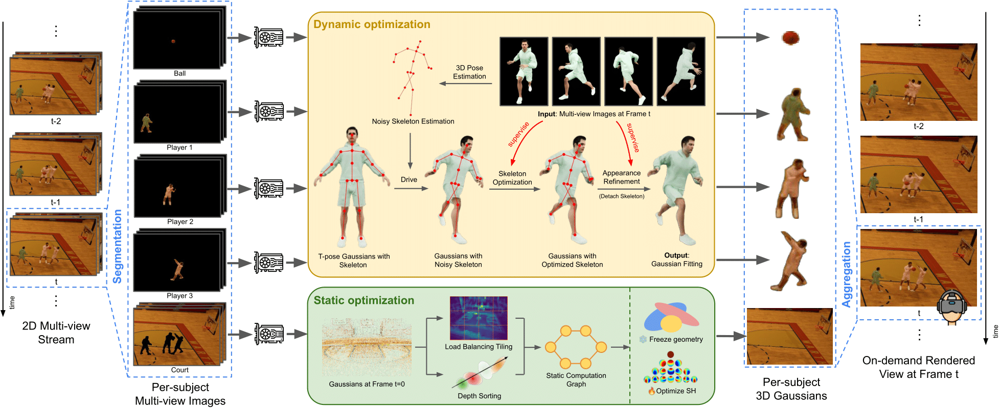

# :basketball: Echoes of the Coliseum: Towards 3D Live streaming of Sports Events
Junkai Huang*, Saswat Subhajyoti Mallick*, Alejandro Amat, Marc Ruiz Olle, Albert Mosella-Montoro, Bernhard Kerbl, Francisco Vicente Carrasco, Fernando De la Torre 
<br>
*(\* indicates equal contribution)*

[](https://humansensinglab.github.io/basket-multiview/)
[](10.1145)
[](https://humansensinglab.github.io/basket-multiview/data.html#download_section)
[](https://challenge.shannon.humansensing.cs.cmu.edu/)

<p align="center">
    
</p>

**TL;DR** We introduce a framework that takes multi-view video streams of sports events as input and reconstructs the dynamic 3D scene to allow viewers to watch from any novel view with interactive frame rates.

## :floppy_disk: Dataset
We introduce the **BASKET-Multiview** dataset, a synthetic collection of scenarios representing common basketball plays. We provide comprehensive annotations that include calibrated cameras, animations, RGB images, segmentation masks, depth maps, surface normals, SMPL meshes and animations. All scenes are rendered at 1080p/4K and 30 fps.
<p align="center">
    
</p>

The instructions for downloading are outlined in our [webpage](https://humansensinglab.github.io/basket-multiview/data.html#download_section). A visualization script is provided for understanding the conventions of this dataset.

The SMPL meshes are obtained by fitting to the ground truth skeleton, and might not be perfect. Since we cannot redistribute the original character assets due to licensing restrictions, researchers interested in perfect meshes can obtain them from their original [source](https://www.fab.com/listings/2eebf211-df72-4daf-a8c4-24bfadba9e7a).

## :checkered_flag: Challenge
We release the BASKET-Multiview Reconstruction Challenge that evaluates 4D reconstruction methods on their ability to reconstruct dynamic scenes from multi-view observations. Participants will work with the released game sequences and reconstruct using the test cameras. For submission instructions and detailed evaluation policies, please refer to our [competition page](https://challenge.shannon.humansensing.cs.cmu.edu/web/challenges/challenge-page/21/overview).


## :crystal_ball: Method
**LiveSplats** processes *k* frames together, where each frame is handled by a node. First it segments multi-view images at frame t, to obtain per-subject segmentation masks for each subject, and passes the masked RGB images of each subject to a GPU in the respective node. Each GPU will then optimize 3D Gaussians at t for that subject, using either dynamic or static optimization logic. The optimized 3D Gaussians are collected from each GPU and aggregated into a single model, and then served for on-demand renderings from arbitrary viewpoints to clients.
<p align="center">
    
</p>


## :microscope: Citation
If you find this project useful, please cite:
```
@article{10.1145/3731214,
  author = {Huang, Junkai and Subhajyoti Mallick, Saswat and Amat, Alejandro and Ruiz Olle, Marc and Mosella-Montoro, Albert and Kerbl, Bernhard and Vicente Carrasco, Francisco and De la Torre, Fernando},
  title = {Echoes of the Coliseum: Towards 3D Live streaming of Sports Events},
  year = {2025},
  issue_date = {August 2025},
  publisher = {Association for Computing Machinery},
  address = {New York, NY, USA},
  volume = {44},
  number = {4},
  issn = {0730-0301},
  url = {https://doi.org/10.1145/3731214},
  doi = {10.1145/3731214},
  journal = {ACM Trans. Graph.},
  month = jul,
  articleno = {46},
  numpages = {17},
  keywords = {sports events, human-centric events, gaussian splatting, real-time 3D reconstruction}
}
```