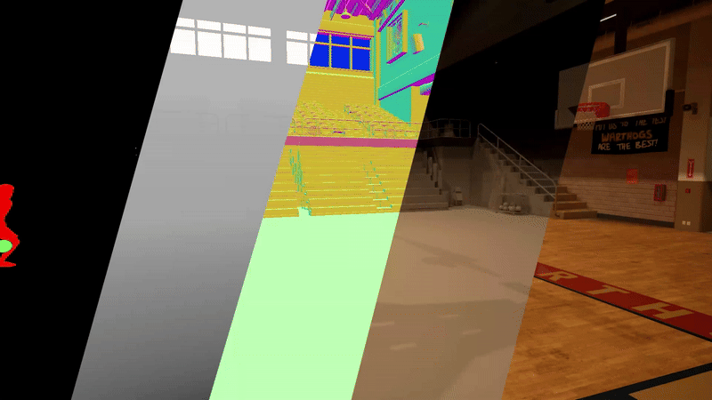

# Echoes of the Coliseum: Towards 3D Live streaming of Sports Events

Junkai Huang*, Saswat Subhajyoti Mallick*, Alejandro Amat, Marc Ruiz Olle, Albert Mosella-Montoro, Bernhard Kerbl, Francisco Vicente Carrasco, Fernando De la Torre 
<br>
*(\* indicates equal contribution)*

[](https://humansensinglab.github.io/basket-multiview/)
[](10.1145)
[](https://humansensinglab.github.io/basket-multiview/data.html#download_section)
[](https://challenge.shannon.humansensing.cs.cmu.edu/)


This repository contains the official authors implementation associated with the paper "Echoes of the Coliseum: Towards 3D Live streaming of Sports Events", which can be found [here](https://dl.acm.org/doi/epdf/10.1145/3731214).

<p align="center">
    
</p>

Abstract: *Human-centered live events have always played a pivotal role in shaping culture and fostering social connections. Traditional 2D live transmissions fail to replicate the immersive quality of physical attendance. Addressing this gap, this paper proposes LiveSplats, a framework towards real-time, photo-realistic 3D reconstructions of live events using high-performance 3D Gaussian Splatting.
Our solution capitalizes on strong geometric priors to optimize through distributed processing and load balancing, enabling interactive, freely explorable 3D experiences. By dividing scene reconstruction into actor-centric and environment-specific tasks, we employ hierarchical coarse-to-fine optimization to rapidly and accurately reconstruct human actors based on pose data, refining their geometry and appearance with photometric loss. For static environments, we focus on view-dependent appearance changes, streamlining rendering efficiency and maximizing GPU performance. To facilitate evaluation, we introduce (and distribute) a synthetic benchmark dataset of basketball games, offering high visual fidelity as ground truth. In both our synthetic benchmark and publicly available benchmarks, LiveSplats consistently outperforms existing approaches. The dataset is available at https://humansensinglab.github.io/basket-multiview.*

<section class="section" id="BibTeX">
  <div class="container is-max-desktop content">
    <h2 class="title">BibTeX</h2>
    <pre><code>@Article{10.1145/3731214,
      author = {Huang, Junkai and Subhajyoti Mallick, Saswat and Amat, Alejandro and Ruiz Olle, Marc and Mosella-Montoro, Albert and Kerbl, Bernhard and Vicente Carrasco, Francisco and De la Torre, Fernando},
      title = {Echoes of the Coliseum: Towards 3D Live streaming of Sports Events},
      journal = {ACM Trans. Graph.},
      volume = {44},
      number = {4},
      month = jul,
      year = {2025},
      url = {https://doi.org/10.1145/3731214},
}</code></pre>
  </div>
</section>

## Dataset
We introduce the **BASKET-Multiview** dataset, a synthetic collection of scenarios representing common basketball plays. We provide comprehensive annotations that include calibrated cameras, animations, RGB images, segmentation masks, depth maps, surface normals, SMPL meshes and animations. All scenes are rendered at 1080p/4K and 30 fps.
<p align="center">
    
</p>

The instructions for downloading are outlined in our [webpage](https://humansensinglab.github.io/basket-multiview/data.html#download_section). A visualization script is provided for understanding the conventions of this dataset.

The SMPL meshes are obtained by fitting to the ground truth skeleton, and might not be perfect. Since we cannot redistribute the original character assets due to licensing restrictions, researchers interested in perfect meshes can obtain them from their original [source](https://www.fab.com/listings/2eebf211-df72-4daf-a8c4-24bfadba9e7a).

### Data Directory Structure

After downloading, place the data under the `data/` folder. The expected structure is as follows.

**Character binding data** (`data/players_A_pose/{gender}/`, e.g. `data/players_A_pose/male/`):
```
data/players_A_pose/{gender}/
├── cameras/
│   ├── cameras.bin
│   ├── cameras.txt
│   ├── images.bin
│   ├── images.txt
│   ├── points3D.bin
│   └── points3D.txt
├── objs/
│   └── 0000.obj                    # T-pose / binding-pose mesh
├── rgb/
│   └── {clothing}/                 # e.g. clothing_black/
│       └── {skin}/                 # e.g. skin_color_1/
│           └── cam_{XXXX}/
│               └── {TTTT}.png
├── masks/
│   └── cam_{XXXX}/
│       └── {TTTT}.png
└── normals/
    └── cam_{XXXX}/
        └── {TTTT}.png
```
The `binding/` sub-directory is generated automatically by `run_binding_pipeline.py` and will be populated there:
```
data/players_A_pose/{gender}/
└── binding/
    └── {clothing}/
        └── {skin}/
            ├── assoc.txt           # vertex-to-Gaussian associations
            └── 0/
                ├── cameras.json
                ├── cfg_args
                ├── checkpoints/
                │   └── 0000.ply
                └── sample_renders/
```

**Dynamic assets** (`data/dynamic_objects/{asset}/`, e.g. `data/dynamic_objects/ball/`):
```
data/dynamic_objects/{asset}/
├── cameras/
│   ├── cameras.bin / cameras.txt
│   ├── images.bin  / images.txt
│   └── points3D.bin / points3D.txt
├── images/
│   └── {TTTT}.png
├── rgb/
│   └── cam_{XXXX}/
│       └── {TTTT}.png
├── masks/
│   └── cam_{XXXX}/
│       └── {TTTT}.png
├── normals/
│   └── cam_{XXXX}/
│       └── {TTTT}.png
└── objs/
    └── 0000.obj
```

**Scene sequence data** (`data/basket_mv_dataset/{scene}/`, e.g. `data/basket_mv_dataset/def_2/`):
```
data/basket_mv_dataset/{scene}/
├── cameras/
│   ├── cameras.bin
│   ├── cameras.txt
│   ├── images.bin
│   ├── images.txt
│   └── depth_params.json           # optional, per-camera depth scale
├── rgb/
│   └── cam_{XXXX}/
│       └── {TTTT}.png
├── depth/                          # or true_depth/ for metric depth
│   └── cam_{XXXX}/
│       └── {TTTT}.npz
├── normals/
│   └── cam_{XXXX}/
│       └── {TTTT}.png
├── masks/
│   └── cam_{XXXX}/
│       └── {TTTT}.png              # semantic segmentation (RGB-encoded)
├── skeleton/
│   └── {object_key}/               # one sub-dir per character, e.g. player_0/
│       └── {TTTT}.skl              # per-frame skeleton file
└── objs/
    └── {object_key}/               # one sub-dir per dynamic asset, e.g. ball/
        └── {TTTT}.obj              # per-frame mesh file
```

Background point clouds (`.ply` files, e.g. `data/atc2_bg.ply`) are stored directly under `data/`. They can be reconstructed using a vanilla 3DGS repository with depth regularization.

## Setup

Make sure to clone the repo using `--recursive`:
```
git clone https://github.com/humansensinglab/HS_Gaussian_Splatting.git --recursive
cd HS_Gaussian_Splatting
```

### System requirements
`g++` is required to compile the vertex-to-Gaussian association tool (`scripts/pose_to_ply.cpp`) during the binding pipeline. Install it via your package manager if not already available:
```
# Ubuntu / Debian
sudo apt install g++
```

### Python environment 
```
conda create -n livesplat python=3.12 -y
conda activate livesplat
pip install torch==2.3.0 torchvision==0.18.0 torchaudio==2.3.0 --index-url https://download.pytorch.org/whl/cu121 
pip install -r requirements.txt

# Install CUDA-dependent submodules (must be installed with --no-build-isolation)
pip install --no-build-isolation submodules/diff-gaussian-rasterization
pip install --no-build-isolation submodules/fused-ssim
pip install --no-build-isolation submodules/simple-knn
pip install --no-build-isolation submodules/diff-gaussian-rasterization-accelerated
pip install --no-build-isolation submodules/bonebone
```

## Training Pipeline

### Run binding-pose pipeline
This command is used to produce the binding pose gaussians for all characters in the scene. Then, create association between the meshes vertices and gaussians for each characte. The ball is trained from the closeup camera view as referenced static:
```
python scripts/run_binding_pipeline.py --base_root data/players_A_pose/male --gpus all
python scripts/run_binding_pipeline.py --base_root data/players_A_pose/female --gpus all\
python scripts/train_dynamic_bind.py --source_path data/players_A_pose/ball --model_path data/players_A_pose/ball/binding --dataset_type "basket_mv" --first_frame_obj /data/players_A_pose/ball/objs/0000.obj
```

### Run whole scene reconstuction pipeline
```
python run_training_pipeline.py --scene_path data/basket_mv_dataset/atc_2 \
                                --binding_root data/players_A_pose \
                                --asset_root data/dynamic_objects \
                                --output_root output/atc_2 \
                                --first_frame_bg data/atc2_bg.ply \
                                --noisy_skeleton \
                                --use_static_graph \
                                --eval \
                                --gpus all
```

* `--scene_path` is the dataset subfolder of the scene sequence.
* `--binding_root` is the dataset subfolder containing binding for all characters
* `--asset_root` is the dataset subfolder of all dynamic assets
* `--output_root` is the output folder of te scene reconstruction.
* `--first_frame_bg` stores the gaussians of scene background for static optimization.
* `--noisy_skeleton` use skeleton optimization for noisy input skeleton
* `--use_static_graph` use CUDA graph to speed up static optimization
* `--eval` split data for 1 test every 10 view
* `--render` render images of each componenent
* `--gpus` specifies gpu ids to use for training parallelly


## Details on the different steps

### Train binding-pose character
This command is used to produce the binding pose gaussians for a character.
```
BASE_ROOT=data/players_A_pose/male
SKIN=clothing_black/skin_color_1
python scripts/train_dynamic_bind.py --$BASE_ROOT \
                                     --rgb_source_path $BASE_ROOT/rgb/$SKIN \
                                     --model_path $BASE_ROOT/binding/$SKIN \
                                     --first_frame_obj $BASE_ROOT/objs/0000.obj \
                                     --dataset_type basket_mv
```


### Match character binding to human in the scene
This command is used to find the matching from the list of character bindings to a person in the scene
```
python scripts/smatch_binding_to_person.py \
    --source_path data/basket_mv_dataset/atc_2 \
    --binding_root data/players_A_pose \
    --object_key player_0 \
    --dataset_type basket_mv \
    --output_json output/atc_2/dynamic/player_0/binding_matching.json
```


### Train a ball sequence 
This command is used to train dynamic assets in the the sequence
```
python scripts/train_dynamic_ball.py \
    --source_path data/basket_mv_dataset/atc_2 \
    --model_path output/atc_2/dynamic \
    --object_key ball \
    --first_frame_obj data/dynamic_objects/ball/objs/0000.obj \
    --first_frame_ply data/dynamic_objects/ball/binding/0/checkpoints/0000.ply \
    --dataset_type basket_mv 
```

### Train a human sequence
This command is used to train a single character for every frames in a sequence, use --noisy_skeleton to turn on the skeleton optimization. 

```
python scripts/train_dynamic_skeleton.py \
    --source_path data/basket_mv_dataset/atc_2 \
    --model_path output/atc_2/dynamic \
    --object_key player_0 \
    --first_frame_ply data/players_A_pose/male/binding/clothing_green/skin_color_1/0/checkpoints/0000.ply \
    --dataset_type basket_mv --noisy_skeleton 
```

### Static optimization of a sequence
This command is used to optimize the static gaussians for every frame in a sequence, use `--use_precomputed` and optionally `--use_cuda_graph` to speed up training.

> **VRAM note:** `--use_precomputed` alone skips the geometry pass (sort + tile-bin) for all frames after frame 0 and is safe on GPUs with ~20 GB VRAM. Adding `--use_cuda_graph` on top records one CUDA graph per camera view during a warmup phase, which keeps all captured graph buffers resident simultaneously and can OOM on 20 GB GPUs. Use `--use_cuda_graph` only if you have sufficient headroom (typically ≥24 GB).
```
python scripts/train_static_opt.py \
    --source_path data/basket_mv_dataset/atc_2 \
    --object_key background \
    --model_path output/atc_2/static \
    --dataset_type basket_mv \
    --first_frame_ply data/atc1_bg_.ply \
    --use_precomputed \
    --use_cuda_graph \
    --use_load_balancing
```
## Evaluation
VMAF is a video metric by Netflix. 
Reference: [GitHub](https://github.com/Netflix/vmaf)

Run evaluation for a sequence:
```
python scripts/evaluate \
    --output_path output/atc_2 \
    --source_path data/basket_mv_dataset/atc_2 \
    --img_metrics
    --masked_psnr
    --skl_error
    --group_skl_error
```